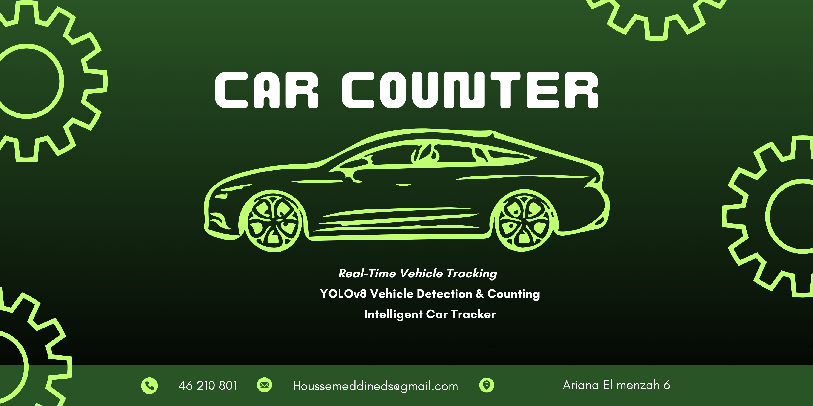

"# Car-Counter" 
# Car Counter: Advanced Vehicle Detection & Tracking System
## 🚗 Overview


Car Counter is a computer vision application that detects, tracks, and counts vehicles in video footage using state-of-the-art object detection and tracking algorithms. The system can identify multiple vehicle types including cars, trucks, buses, and motorbikes as they cross a virtual counting line.

## 🎥 Demo

https://user-images.githubusercontent.com/your-username/your-video-link.mp4

Or watch this short demo video below:

<video src="data/CarDemo.mp4" controls autoplay muted width="100%"></video>

## ✨ Features
- Multi-class Vehicle Detection : Identifies cars, trucks, buses, and motorbikes using YOLOv8
- Real-time Tracking : Implements SORT (Simple Online and Realtime Tracking) algorithm with Kalman filtering
- Counting System : Counts vehicles as they cross a defined line in the video
- Region Masking : Uses a mask to focus detection on relevant areas of the frame
- Visual Feedback : Displays bounding boxes, vehicle IDs, confidence scores, and total count
## 🛠️ Technologies
- Python : Core programming language
- OpenCV : Image processing and visualization
- YOLOv8 : State-of-the-art object detection
- SORT Algorithm : Object tracking across video frames
- NumPy : Numerical operations and array handling
- cvzone : Enhanced visualization utilities
## 📋 Requirements
```
python >= 3.8
opencv-python
numpy
ultralytics
cvzone
filterpy
```
## 🚀 Installation
1. Clone the repository:
   
   ```
   git clone https://github.
   com/Houssemds/Car-Counter.
   git
   cd Car-Counter
   ```

2. Download YOLOv8 weights ):
   
   ```
   # Ensure you have the 
   weights file at ../
   Yolo-Weights/yolov8s.pt
   ```
## 💻 Usage
1. Place your video file in the appropriate location (default: ../videos/cars.mp4 )
2. Run the main script:
   ```
   python Car_Counter.py
   ```
3. The application will display the video with detection boxes, tracking IDs, and a count of vehicles crossing the defined line.
## ⚙️ Configuration
You can modify the following parameters in Car_Counter.py :

- VIDEO_PATH : Path to the input video file
- YOLO_MODEL_PATH : Path to the YOLOv8 weights
- MASK_PATH : Path to the mask image for region of interest
- TARGET_CLASSES : Vehicle types to detect and count
- CONFIDENCE_THRESHOLD : Minimum confidence score for detections
- LINE_POSITION : Coordinates of the counting line [x1, y1, x2, y2]
## 🧠 How It Works
1. Detection : YOLOv8 detects vehicles in each frame
2. Filtering : Only selected vehicle classes with confidence above threshold are processed
3. Tracking : SORT algorithm assigns and maintains IDs for each vehicle across frames
4. Counting : When a vehicle's center crosses the defined line, it's counted once
5. Visualization : Results are displayed with bounding boxes, IDs, and counts
## 🤝 Contributing
Contributions are welcome! Please feel free to submit a Pull Request.

## 📄 License
This project is licensed under the MIT License - see the LICENSE file for details.

## 🙏 Acknowledgements
- Ultralytics YOLOv8
- SORT (Simple Online and Realtime Tracking)
- cvzone
Note: This project is for educational purposes. Please ensure you have the right to analyze any video footage used with this software.